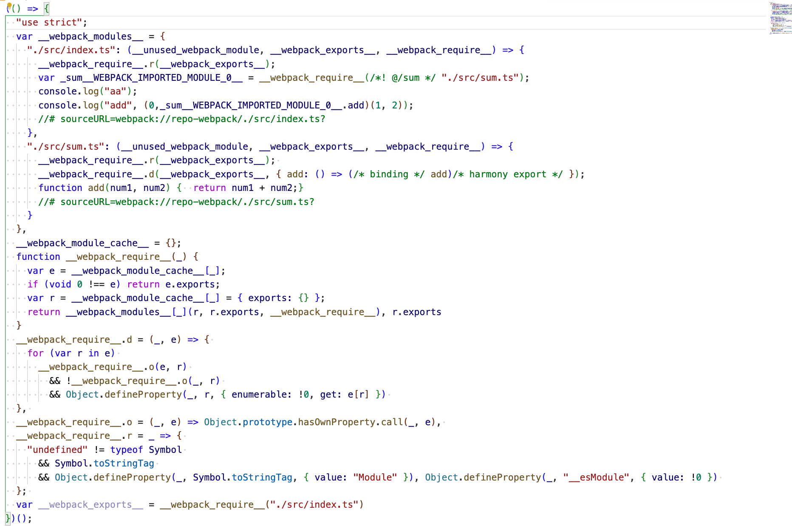

# 打包结果分析
> webpack 通过入口构建整个项目的依赖图，webpack 把每个文件都当作是一个 module，最终在 emit 静态资源时，通过策略（也就是我们配置的规则或者工具内部默认的规则）生成对应的 bundles

## 模块引入方式
目前我们引入模块方式无非下面三种方式:

1. import xxx from "xxx"
2. import("xxxx") 
3. Module federation 其实还是一种异步的方式类似于第二种，像第二种一般是同一个工程下的，而 MF 一般都是跨工程进行引用的

针对异步的模块最终都会单独生成一个 bundles，在需要使用的时候进行加载，而对于 MF 一般都是从 CDN 直接加载资源的，只需要进行配置即可

## 分析
> 从简到难，由浅入深

### example one
比如有一个 index.ts 作为入口，依赖 sum 模块，来进行算数
```ts
// index.ts
import { add } from "./sum"
console.log("aa")

console.log("add", add(1, 2))
// add.ts
export function add(a: number, b: number) {
  return a + b
}
```
打包结果如下图 
1. 首先可以看到在 \_\_webpack_modules\_\_ 中存在两个模块，一个是 index.ts 一个是 sum.ts 模块（符合上面所说，每一个文件都是一个模块），每一个模块是一个函数, 函数执行时，依赖三个参数
2. 定义了一个 __webpack_module_cache 用于存放已经加载过的模块，避免重复加载，每一个 key 是对应的模块的 key(与 \_\_webpack_module\_\_中对应)，值是一个嵌套结构```{ exports: {} }```
3. 定义了一个 \_\_webpack_require\_\_ 函数，用于加载模块，因为 webpack 构建的时候需要支持多种模块化方案，所以目前的解决方案就是重写一套自己的，对于每一个模块都用 [AST](https://astexplorer.net/) 进行分析，转换成符合自己定义模块的格式
4. 额外模块的定义
   1. \_\_webpack_require\_\_.o 函数
   2. \_\_webpack_require\_\_.r 函数
   3. \_\_webpack_require\_\_.d 函数
5. 基于入口函数进行执行

